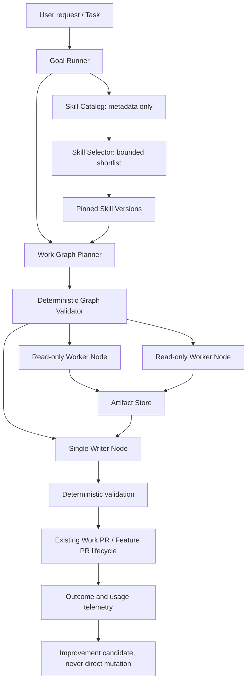

# Governed Skills and Multi-Agent Architecture Study

Issue: #39

## Executive decision

The Maestro should add two separate deep modules:

1. **Governed Skill Runtime**: discovers, validates, selects, pins, loads, evaluates and rolls back
   reusable operating procedures.
2. **Multi-Agent Work Graph**: decomposes one Goal into bounded Worker Nodes, executes independent
   read-heavy nodes in parallel, and preserves one controlled writer at a time.

They must not be collapsed into one "smart agent" module. Skills answer **how to work**. The Work
Graph answers **who does which bounded part, in what order, with what budget and write scope**.

The Maestro remains the manager. Providers such as Codex and Claude remain execution adapters. A
specialist role is configuration applied to a Worker Node, not a new long-lived independent authority.

## Why this is the next architectural step

The current system already has strong foundations:

- durable Goals and steps in SQLite;
- capability-based Provider routing, leases, cooldown and fallback;
- deterministic environment checks, deadlines and circuit breakers;
- Task worktrees, Work PR evidence and one Feature PR merge candidate;
- restricted background improvement review that creates candidates rather than mutations;
- a Constitution that protects approvals, secrets, audit and rollback boundaries.

The missing layer is reusable procedural knowledge and bounded specialist decomposition. Today, the
same broad planning/coding/testing prompts must rediscover process on each Goal. The Provider registry
chooses **which external executor** handles a phase, but it does not choose **which reusable procedure**
or **which specialist work decomposition** should apply.

## Sources studied

### Codex and the Agent Skills standard

Codex Skills use progressive disclosure: only name, description and path are initially visible; the
full `SKILL.md` is loaded when selected. Skills may include scripts, references and assets, and can be
invoked explicitly or selected from their descriptions. The open Agent Skills specification defines
the portable directory format.

Sources:

- [Codex: Build skills](https://learn.chatgpt.com/docs/build-skills.md)
- [Agent Skills specification](https://agentskills.io/specification)
- [OpenAI skills repository](https://github.com/openai/skills)

### Claude Agent Skills

Claude uses the same three-level pattern: metadata is always available, instructions load after a
trigger, and resources or executable code load only when needed. Anthropic explicitly treats Skills
like installed software because scripts, external content and tool access can leak data or mutate the
environment.

Sources:

- [Claude Agent Skills overview](https://platform.claude.com/docs/en/agents-and-tools/agent-skills/overview)
- [Anthropic skills repository](https://github.com/anthropics/skills)

### Hermes

Hermes is strongest as a reference for lifecycle governance around autonomous learning:

- a restricted background reviewer extracts possible memories or Skill improvements;
- write provenance distinguishes background-created artifacts from user-directed artifacts;
- autonomous changes apply read-before-write and origin protection;
- usage telemetry feeds stale and archive decisions;
- the Curator supports dry-run, pinning, snapshots, archive and restore.

The important lesson is not "let the model edit `SKILL.md`". It is the protective system around that
mutation.

Sources:

- [Hermes Agent repository](https://github.com/NousResearch/hermes-agent)
- [Background review](https://github.com/NousResearch/hermes-agent/blob/main/agent/background_review.py)
- [Curator](https://github.com/NousResearch/hermes-agent/blob/main/agent/curator.py)
- [Skill provenance](https://github.com/NousResearch/hermes-agent/blob/main/tools/skill_provenance.py)
- Existing local analysis: [HERMES_APPLIED_STUDY.md](HERMES_APPLIED_STUDY.md)

### Matt Pocock engineering skills

The studied skill set treats predictability as the root virtue. Useful patterns include:

- narrow skills with explicit completion criteria;
- a router when user-invoked skills create too much cognitive load;
- one source of truth with progressive disclosure instead of giant instructions;
- fixed-point code review split into independent Standards and Spec axes;
- TDD at agreed public seams;
- diagnosis that refuses hypotheses until a tight feedback loop exists;
- a main flow from idea to spec, dependency-aware tickets, implementation and review.

Source: [mattpocock/skills](https://github.com/mattpocock/skills)

### OpenAI Agents SDK

The SDK separates two useful orchestration patterns:

- **agents as tools**: a manager keeps control and calls specialists for bounded subtasks;
- **handoffs**: control of the conversation moves to a specialist.

It also recommends code orchestration when speed, cost and behavior should be predictable, reserving
LLM-directed orchestration for open-ended work.

Sources:

- [Agent orchestration](https://openai.github.io/openai-agents-js/guides/multi-agent/)
- [Handoffs](https://openai.github.io/openai-agents-js/guides/handoffs/)
- [Human in the loop](https://openai.github.io/openai-agents-js/guides/human-in-the-loop/)

### LangGraph, OpenHands and AutoGen

- LangGraph emphasizes durable state, explicit nodes and edges, resumability and human inspection.
  Its documentation warns that subagent context and state visibility require deliberate design.
- OpenHands combines repository Skills with setup and stop hooks, making deterministic quality gates
  independent from model judgment.
- AutoGen provides event-driven and conversational multi-agent patterns, but shared group-chat context
  can amplify context growth and makes write coordination harder.

Sources:

- [LangGraph overview](https://docs.langchain.com/oss/python/langgraph/overview)
- [LangChain subagents](https://docs.langchain.com/oss/python/langchain/multi-agent/subagents)
- [OpenHands repository customization](https://docs.openhands.dev/openhands/usage/customization/repository)
- [AutoGen](https://microsoft.github.io/autogen/stable/index.html)

### Anthropic production lessons

Anthropic reports that multi-agent systems help most with breadth-first, heavily parallel work. The
same report warns that they can consume roughly fifteen times the tokens of chat interactions, are a
poor fit for dependency-heavy work, and require explicit effort budgets, detailed delegation,
observability, checkpoints and end-state evaluation. Their production pattern also stores subagent
artifacts outside the coordinator context and passes lightweight references back.

Source: [How we built our multi-agent research system](https://www.anthropic.com/engineering/multi-agent-research-system)

## Comparison

| System | Skill loading | Multi-agent shape | Strongest lesson | Risk to avoid |
| --- | --- | --- | --- | --- |
| Codex | metadata, then `SKILL.md`, then resources | parallel subagents with distilled return | context hygiene and explicit delegation | parallel writers and hidden token multiplication |
| Claude | three-level progressive disclosure | orchestrator-worker research | effort scales with complexity | uncontrolled fan-out and expensive coordination |
| Hermes | filesystem Skills plus usage lifecycle | background reviewer and auxiliary agents | provenance, curation and rollback | direct autonomous mutation |
| OpenAI Agents SDK | instructions/tools per specialist | manager-as-tools or handoffs | central manager for shared guardrails | passing full history to every specialist |
| LangGraph | application-defined | durable graph and subgraphs | explicit state and resumability | invisible nested state and malformed handoffs |
| OpenHands | repository Skills | mostly one coding agent plus delegates | deterministic hooks around agent work | prompt-only quality gates |
| AutoGen | agent configuration | group chat, swarm and event runtime | flexible experimentation | context broadcast and coordination sprawl |
| Matt skills | focused `SKILL.md` workflows | selected parallel review/research | predictable process and tight feedback loops | skill sprawl and premature completion |

## Recommended model



### 1. Governed Skill Runtime

The public interface should remain small:

```ts
interface SkillRuntime {
  discover(scope: SkillScope): SkillMetadata[];
  select(request: SkillSelectionRequest): SkillSelection;
  pin(selection: SkillSelection, runId: number): PinnedSkillSet;
  load(pinned: PinnedSkillSet, resource: SkillResourceRequest): SkillResource;
  record(result: SkillRunResult): void;
}
```

Complexity hidden behind this seam:

- schema and path validation;
- metadata indexing and bounded descriptions;
- deterministic shortlist before any model-assisted selection;
- immutable content hash and active version pointer;
- scope resolution: system, user, repository and project;
- resource loading only on demand;
- script policy validation;
- trigger reason and usage telemetry;
- deprecation, archive and rollback.

### 2. Skill package

Use the Agent Skills directory format for interoperability, with a Maestro policy file as an optional
superset:

```text
skill-name/
  SKILL.md
  references/
  scripts/
  assets/
  maestro.yaml
  evals/
```

`SKILL.md` remains portable. `maestro.yaml` contains governance that other runtimes may ignore:

- owner: `system`, `user` or `agent`;
- risk and allowed capabilities;
- allowed operating systems;
- network policy;
- read and write scopes;
- maximum runtime and output;
- activation policy;
- replacement or supersession relation.

Scripts are not permission grants. They must declare inputs, outputs, timeout, supported OS, network
use and write scope. The runtime executes only validated declared entry points.

### 3. Selection and context budget

Selection follows a bounded sequence:

1. explicit Skill requested by the user or Task;
2. required Skill declared by Feature or project policy;
3. deterministic capability, keyword and scope match;
4. optional model choice over a shortlist capped at eight metadata records;
5. no Skill when confidence is below threshold.

Only selected Skill instructions enter the run. References and scripts are loaded by explicit path on
demand. A Goal pins versions before its first Provider call, so a Curator or user update cannot change
the behavior of an active run.

### 4. Skill lifecycle

```text
candidate -> evaluated -> approved -> active -> deprecated -> archived
                       \-> rejected
active -> rolled_back
```

- `system`: protected and changed only by reviewed code.
- `user`: never auto-archived or merged.
- `agent`: eligible for governed curation after enough evidence.

An improvement review may propose a Skill candidate. Approval creates an ordinary Task and Feature
Plan. Activation happens only after tests, review and merge. This preserves the current Constitution.

### 5. Skill evaluation

Every Skill needs four test classes:

1. positive trigger prompts;
2. negative trigger prompts;
3. forward tests that execute the workflow on realistic fixtures;
4. deterministic script tests when scripts exist.

Compare Skill version A and B on:

- completion rate and end-state correctness;
- validation and review findings;
- first useful action time and total duration;
- input/output token estimate;
- Provider attempts, fallbacks and timeouts;
- redundant tool calls and duplicated work.

A version is not promoted merely because a reviewer says it is better. It must beat or preserve the
baseline without violating budgets or guardrails.

### 6. Multi-Agent Work Graph

The first implementation should be a Maestro-controlled graph, not uncontrolled Provider-native
subagents. A Worker Node declares:

```ts
type WorkerNode = {
  id: string;
  role: "researcher" | "planner" | "implementer" | "tester" | "reviewer";
  capability: AgentCapability;
  dependsOn: string[];
  inputArtifacts: string[];
  outputContract: string;
  skillVersions: string[];
  mode: "read_only" | "writer";
  writeScope: string[];
  maxAttempts: number;
  deadlineMs: number;
  outputChars: number;
};
```

The graph validator rejects:

- cycles;
- missing dependencies or output contracts;
- overlapping parallel writer scopes;
- more than one writer in the first milestone;
- excessive fan-out, attempts, deadlines or output budgets;
- roles without a compatible ready Provider;
- Skills whose policy exceeds the node permissions.

### 7. Parallelism policy

Start conservative:

- parallelize repository exploration, primary-source research, test execution and independent review;
- serialize planning decisions that depend on prior evidence;
- allow only one writer node per Goal in the first release;
- store large outputs as artifacts and pass references plus bounded summaries;
- cap the default graph at four Worker Nodes and two concurrent read-only nodes;
- use multiagent execution only when estimated complexity crosses a threshold.

Do not use multiagent mode for simple fixes, linear refactors or tasks whose workers need the same
large context. A single strong agent is cheaper and often better for those cases.

### 8. Manager pattern, not user-facing handoff

For project work, the Maestro should use the **agents-as-tools** equivalent: it remains the manager,
owns the Goal, enforces budgets and synthesizes evidence. Specialists do not independently talk to the
user or merge work.

Handoffs are reserved for a future conversational interface where a specialist must temporarily own
the dialogue. They are not needed for the coding runtime.

## Initial Skill set

Do not begin with dozens of Skills. Start with three high-frequency, measurable procedures:

1. `diagnose-goal-failure`: builds a tight repro from artifacts and classifies environment, Provider,
   task or architecture failure before proposing repair.
2. `implement-task-safely`: consumes one Task contract, works in vertical slices, runs narrow checks,
   then the deterministic validation runner.
3. `final-feature-review`: reviews only the Feature PR at a pinned head, separating Spec, Standards,
   security and operational evidence without modifying the branch.

After telemetry proves the runtime, consider:

- `research-primary-sources`;
- `design-deep-module`;
- `recover-provider-failure`;
- project-specific Octomynd data and architecture Skills.

## Failure modes and controls

| Failure mode | Control |
| --- | --- |
| Skill triggers too often | negative trigger evals, shortlist threshold, explicit-only policy |
| Skill text grows forever | context budget, references, usage review, no duplicated knowledge |
| Bad self-improvement | candidate-only review, independent evaluation, Feature PR activation |
| User Skill removed | ownership protection and pinning |
| Running Goal changes behavior | immutable pinned Skill versions |
| Subagents duplicate work | explicit objective, output contract and non-overlapping scope |
| Parallel agents edit same code | one writer lease and graph validation |
| Token use explodes | complexity gate, fan-out cap, per-node budgets and measured baseline |
| Coordinator context rots | artifact references and bounded summaries |
| Provider outage stalls graph | existing leases, cooldown, fallback and resumable node state |
| Reviewer approves own change | proposer, implementer and final reviewer identities remain distinct |

## Delivery roadmap

### Feature A: Governed Skill Catalog and Eval Harness ([#40](https://github.com/Everson-s8/octomynd-maestro/issues/40))

Implementation status: merged into `main` by Feature PR
[#46](https://github.com/Everson-s8/octomynd-maestro/pull/46).

1. [x] Define portable Skill metadata and Maestro policy schemas.
2. [x] Discover and validate repository Skills without executing them.
3. [x] Pin immutable Skill versions to Goal runs.
4. [x] Add trigger, forward and script eval fixtures.
5. [x] Add usage, token, latency and outcome telemetry.
6. [x] Ship the initial three Skills behind a feature flag.

### Feature B: Multi-Agent Work Graph ([#47](https://github.com/Everson-s8/octomynd-maestro/issues/47))

Implementation status: merged into `main` by Feature PR
[#52](https://github.com/Everson-s8/octomynd-maestro/pull/52), with operational adoption and canary
validation completed by Feature PR
[#63](https://github.com/Everson-s8/octomynd-maestro/pull/63).

1. [x] Define Work Graph and Worker Node schemas.
2. [x] Add deterministic validation and complexity classification.
3. [x] Execute up to two read-only nodes in parallel.
4. [x] Persist artifacts and lightweight handoffs.
5. [x] Add one writer lease with worktree scope enforcement.
6. [x] Surface graph, budgets, cancellation and node evidence in Dashboard and Telegram.

The first release keeps automatic activation disabled. Work Graphs are an explicit Maestro runtime
primitive until production telemetry proves that complex-task classification saves time or improves
quality without multiplying token use. Safe cancellation of a running graph remains reserved for a
resident coordinator that owns and propagates its `AbortController`.

### Feature C: Governed Skill Lifecycle and Curator

1. Connect improvement candidates to Skill drafts.
2. Add version comparison and promotion gates.
3. Add snapshots, rollback and protected ownership.
4. Add stale telemetry and Curator dry-run reports.
5. Permit automatic archive only for agent-owned Skills after policy thresholds.

### Feature D: Native Provider Delegation Adapters

Only after the Maestro-level Work Graph is stable:

1. add optional Codex subagent and Claude team adapters;
2. import their traces as child Worker Node evidence;
3. preserve the same budgets, artifacts and cancellation contract;
4. compare native delegation against Maestro-managed workers before enabling by default.

## Acceptance criteria for the architecture

- A simple Task still uses one Provider call path and does not pay multiagent overhead.
- A complex read-heavy Task can run independent Worker Nodes concurrently with bounded fan-out.
- No two nodes can mutate overlapping scopes concurrently.
- Every run records selected Skill IDs, immutable versions and trigger reasons.
- Every autonomous Skill proposal has provenance, evidence and independent evaluation.
- A bad active Skill can be rolled back without changing historical Goal evidence.
- Dashboard and Telegram can explain what each worker is doing and why it was selected.
- Before/after evals show whether quality, duration and token use improved.

## Recommendation

Implement **Feature A** first. Skills are the procedural layer that makes later specialist workers
consistent. Starting with subagents before Skill selection, evaluation and provenance would multiply
the current prompts and failure modes rather than improve them.

Do not copy Hermes wholesale and do not migrate the TypeScript runtime to Python. Recreate the useful
contracts in TypeScript and preserve the Maestro's existing Goal, Task, Feature and review lifecycle.
